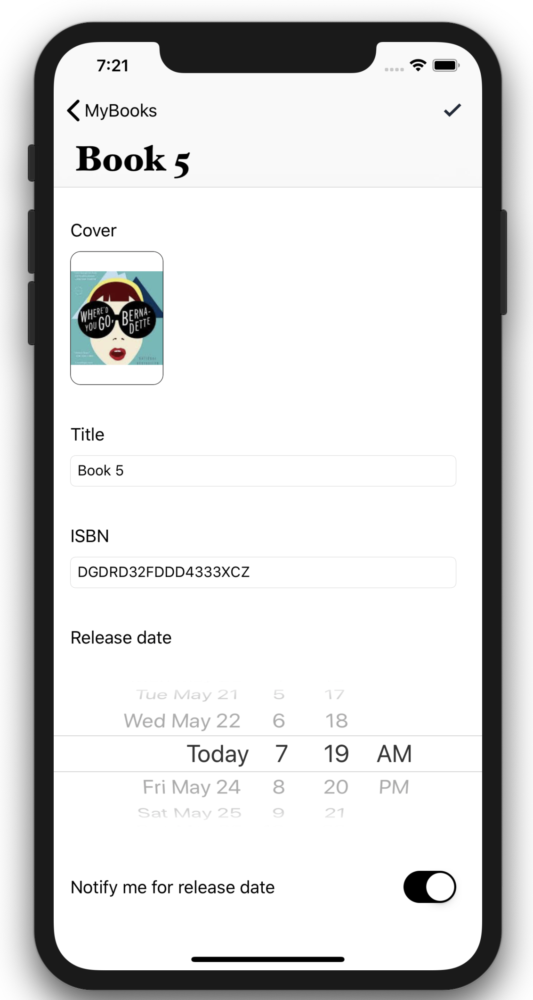
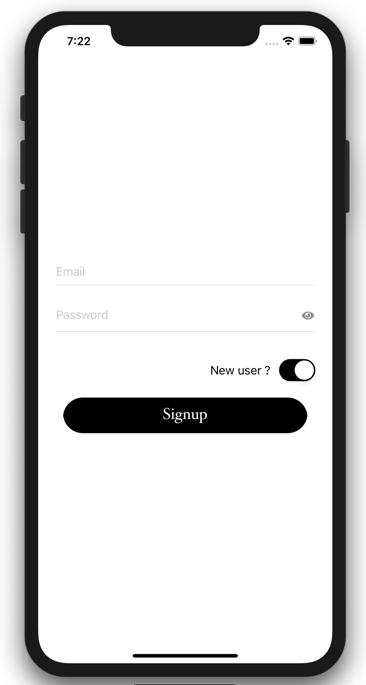

# MyBooks

# User story:
A favorites books application with a list of books, old and new, with some books still to be released.
The features that should be in the application is:
- Authentication (No need for backend)
- Notifications - notify when a book has been released if it was marked to be notified
- Add, edit, and remove list of favorite books.

# Requirements:
- `Xcode` 10.2.1 or later.

# Features:

- Authentication for multiple users (Login/Signup/Logout).
- Local Notifications to notify when a book has been released if it was marked to be notified.
- Add, edit, and remove list of favorite books.
- Unit tests.
- `CoreData` databse to manipulate Users and Books.
- Code written in `Swift` 5.
- Support `iOS` 10 and later.
- Support Portrait/Landscape device orientation.

